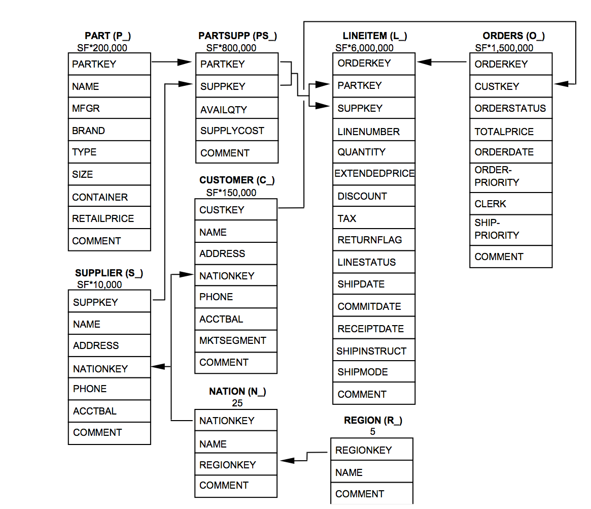

# Programming Assignment 1, CMSC724, Fall 2026

*The assignment is to be done by yourself.*

This assignment focuses on understanding the ANALYZE capabilities provided by PostgreSQL, and on query rewrite stuff.

Like most other database systems, PostgreSQL allows you to analyze query execution plans, and tune the execution. 
The main PostgreSQL commands are EXPLAIN and EXPLAIN ANALYZE. The first one simply prints out 
the plan, but the second one also runs the query and compares the estimated values with 
actual values observed during execution.

An important accompanying command is `VACUUM ANALYZE`; this recalculates all the statistics used by PostgreSQL optimizer.

The assignment here is to answer a few questions using these tools. For the questions, see Gradescope.

You will need **PostgreSQL 15 or later**; some of the plan features the questions ask about don't exist in older versions.
After loading each database, run `VACUUM ANALYZE` in it so that the optimizer has up-to-date statistics.

### Getting the Data

The datasets used in this assignment (two versions of a social network dataset, and a TPC-H database) are provided
in `data.zip`, because they are too large to store in the repository directly. Before you start, unzip it
from inside the `Assignment-1` directory:
```
unzip data.zip
```
This creates `populate-sn.sql`, `populate_sn_med.sql`, and the `tpch/` directory (containing `tpch-load.sql` and the table data files under `tpch/tables/`).

### Social Network Datasets

Two of the questions use a small social network dataset (the "Original Social Network Dataset") -- the load file is `populate-sn.sql`.
Load it into its own database using `createdb sn` followed by `psql -f populate-sn.sql sn`.

A few of the questions use a larger social network dataset with the same schema -- the load file is `populate_sn_med.sql`. 
Load it into a separate database using `createdb sn_med` followed by `psql -f populate_sn_med.sql sn_med`.

### TPC-H Dataset

A few of the questions use a modified TPC-H Benchmark database.
More details on this database are available at: [TPC-H](http://www.tpc.org/tpch)

To load the database:
- Use `createdb tpch` to create a new database.
- Run: `psql -f tpch/tpch-load.sql tpch` from the `Assignment-1` directory. (The data files are loaded using relative paths, so this must be run from the `Assignment-1` directory.)


